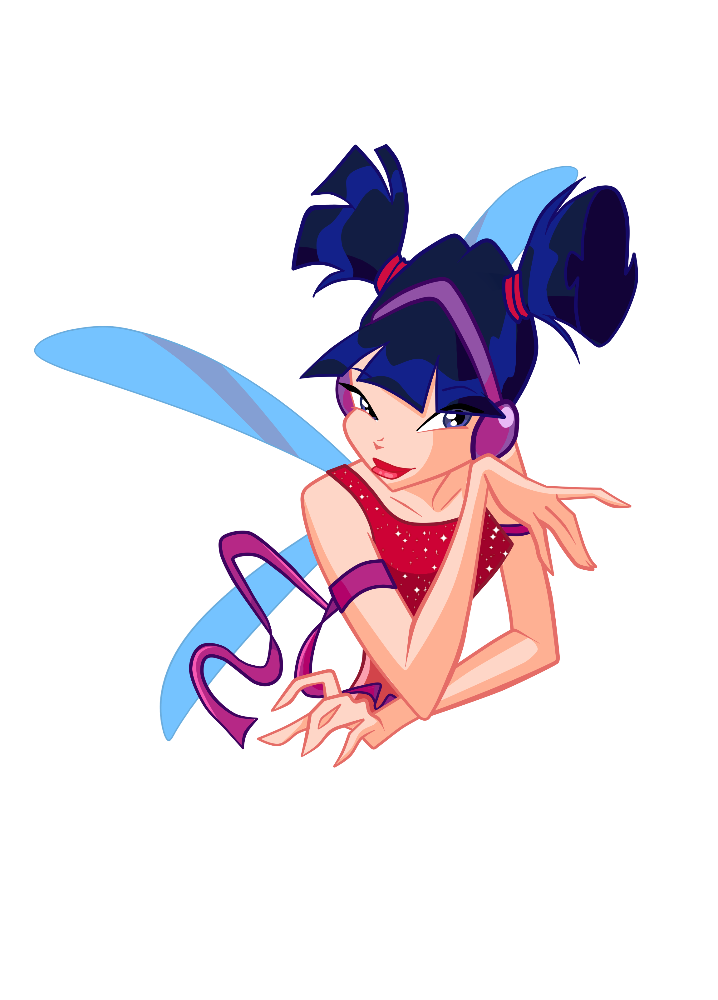

# 🎵 Musa Bot - The Music Fairy

<div align="center">
  
  <br>
  <em>Musa, the Fairy of Music from Winx Club</em>
</div>

## 💫 About Musa

Musa is inspired by the music fairy from Winx Club, bringing magical musical experiences to Discord servers. Originally created for the **WINX** Discord channel (established in 2016), Musa has been the soundtrack companion for a tight-knit gaming community of friends for nearly a decade.

Named after the fairy of music herself, Musa embodies the spirit of bringing people together through the power of music, just like how the WINX server has connected friends through gaming and conversation since 2016.

## ✨ The Evolution Story

### 🎯 Original Vision
- **Born in 2016**: Created for the WINX Discord server to enhance gaming sessions
- **Community-Driven**: Built to serve a close group of gamer friends
- **Music-Focused**: Designed to provide seamless music streaming during gaming

### 🔄 Modern Transformation (2025)
- **Multi-Source Architecture**: Evolved from YouTube-only to multiple music sources
- **Resilient Design**: Adapted to overcome streaming platform restrictions
- **Professional UI**: Implemented unified visual design for better user experience
- **Quality-First**: Advanced filtering to deliver the best audio content

## 🏗️ Technical Architecture

### 🎼 Multi-Source Music System
- **🏆 Radio Stations** (Priority 1) - Live streaming for continuous music
- **📚 Internet Archive** (Priority 2) - Vast collection of quality audio files  
- **📺 YouTube** (Priority 3) - Traditional source, currently in standby mode

### 🛡️ Smart Quality Filtering
- Intelligent file size analysis (prefers >3MB files)
- Creator validation to avoid low-quality uploads
- Duration optimization (2-10 minute sweet spot)
- Automatic filtering of ringtones and sound effects

### 🎨 Unified Visual Experience
- Consistent embed design across all commands
- Service-specific emojis and color coding
- Rich queue visualization with "Now Playing" + "Up Next"
- Professional, gaming-oriented aesthetic

## 🚀 Deployment Guide

### 🏠 Local Development with Docker

1. **Environment Setup**:
```bash
# Copy the environment template
cp .env.example .env

# Edit with your Discord token and settings
nano .env
```

2. **Docker Commands**:
```bash
# Clean slate deployment
docker stop musa-bot-container && docker rm musa-bot-container

# Build the latest image
docker build -t musa-bot .

# Run with environment file
docker run -d --name musa-bot-container --env-file .env musa-bot

# Monitor the magic
docker logs musa-bot-container
```

### ☁️ VPS Deployment

For production deployment on VPS platforms, environment variables are configured directly in the deployment interface without using the .env file.

**Required Environment Variables**:
- `DISCORD_TOKEN` - Your Discord bot token
- `YTDLP_PROXY` - Proxy configuration (if needed)
- `YTDLP_COOKIES` - Path to cookies file
- `YOUTUBE_ENABLED` - Enable/disable YouTube service
- `RADIO_ENABLED` - Enable/disable Radio service  
- `INTERNET_ARCHIVE_ENABLED` - Enable/disable Internet Archive

## 📁 Project Structure

```
musa-bot/
├── 🎭 cogs/                    # Discord command modules
│   └── music.py               # Main music commands with unified UI
├── 🎵 services/               # Music source services
│   ├── internet_archive.py    # Archive.org integration
│   ├── radio.py              # Live radio stations
│   ├── youtube_service.py     # YouTube integration
│   └── multi_source_manager.py # Service coordination
├── 🛠️ utils/                  # Utility functions
│   ├── discord_utils.py       # Discord helpers
│   ├── logging.py            # Event logging
│   └── stream_resolver.py     # Universal stream handling
├── 🍪 cookies/               # YT-DLP cookies (gitignored)
├── 📊 logs/                  # Application logs (gitignored)
├── 🌍 .env                   # Local environment (gitignored)
├── 📋 .env.example           # Environment template
├── 🐳 Dockerfile             # Container configuration
└── ⚙️ config.py              # Application configuration
```

## � Commands Overview

### �🎵 Music Commands
- `/play <song>` - Search and add music to queue
- `/radio <genre>` - Add radio stations by genre  
- `/queue` - Display current playlist with rich UI
- `/skip` - Skip to next track
- `/pause` / `/resume` - Playback control
- `/stop` - Stop music and clear queue

### 🎨 Visual Features
- **Green Embeds**: Playing, resuming, adding songs
- **Blue Embeds**: Queue display, radio stations
- **Orange Embeds**: Pausing, skipping tracks
- **Red Embeds**: Stopping, errors

## 🎯 Gaming Community Legacy

Since 2016, Musa has been the musical heartbeat of the WINX Discord server, providing:
- **Ambient Gaming Music**: Perfect background tracks for gaming sessions
- **Community Bonding**: Shared musical experiences that bring friends together
- **Nostalgia Factor**: Soundtrack to countless memories and adventures
- **Reliability**: Nearly a decade of faithful service to the gaming community

## 🔮 Future Vision

Musa continues to evolve while maintaining her core mission: bringing friends together through music. Whether it's providing the perfect soundtrack for an epic gaming session or discovering new music together, Musa remains the magical musical companion for the WINX community and beyond.

---

<div align="center">
  
  <br>
  <em>"In the power of music, we find the magic that connects us all"</em>
  <br>
  <strong>- Inspired by Musa, Fairy of Music 🎵✨</strong>
</div>
